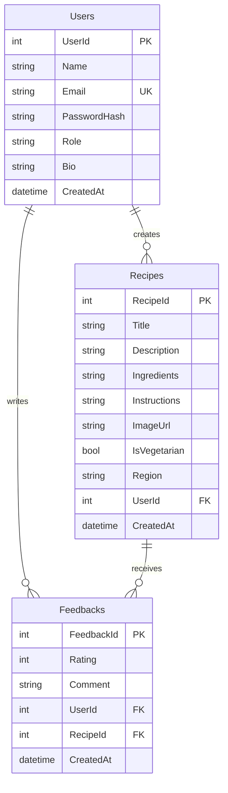

# 🍳 Cooking Recipe Portal

<div align="center">


**A delicious full-stack web application for sharing and discovering amazing recipes! 🌟**

• [📖 Documentation](#-installation--setup) • [🐛 Report Bug](#-troubleshooting) • [✨ Request Feature](#-future-enhancements)

</div>

---

## 🎯 What Makes This Special?

🔥 **Modern Tech Stack** - Built with .NET 8.0 & Angular 18  
🍽️ **Beautiful UI** - Food-themed design with Material Design  
🔐 **Secure Authentication** - JWT tokens with role-based access  
📱 **Responsive Design** - Works perfectly on all devices  
⭐ **Interactive Reviews** - Star ratings with visual feedback  
👨‍🍳 **Admin Dashboard** - Complete management interface  

## 🌟 Features

### 👤 User Experience
- 🔑 **Secure Registration & Login** with JWT authentication
- 👑 **Role-based Access** (Admin & User roles)
- 📝 **Profile Management** with bio updates
- 🔒 **BCrypt Password Security**

### 🍲 Recipe Management
- 📖 **Browse Recipes** with stunning images and ratings
- ➕ **Create Your Own** recipes with detailed instructions
- ✏️ **Edit & Update** your recipes anytime
- 🗑️ **Delete Management** for your own content
- 🏷️ **Name-based API** for better user experience
- 🌶️ **Cuisine Categories** with regional specialties

### ⭐ Feedback System
- 🌟 **5-Star Rating System** with visual feedback
- 💬 **Write Detailed Reviews** and cooking tips
- ✏️ **Edit Your Reviews** with pre-filled data
- 🗑️ **Manage Your Feedback** easily

### 👨‍💼 Admin Features
- 🎛️ **Admin Dashboard** with comprehensive controls
- 🗑️ **Content Moderation** - manage any recipe or review
- 👥 **User Management** and overview
- 📊 **System Analytics**

## 🛠️ Tech Stack

<div align="center">

### Backend


### Frontend


</div>

## 🚀 Quick Start

### Prerequisites
- 📦 .NET 8.0 SDK
- 🟢 Node.js (v18+)
- 🅰️ Angular CLI (v18)
- 🗄️ SQL Server (LocalDB/Express)

### ⚡ Installation & Setup

#### 🔧 Backend Setup
```bash
# Navigate to backend
cd CookingRecipePortal/CookingRecipePortal

# Restore packages
dotnet restore

# Run the application (auto-creates database with seed data)
dotnet run
```
🌐 Backend runs on: `https://localhost:7095`

#### 🎨 Frontend Setup
```bash
# Navigate to frontend
cd recipe-frontend

# Install dependencies
npm install

# Start the application
ng serve
```
🌐 Frontend runs on: `http://localhost:4200`

## 🔐 Default Login Credentials

### 👑 Admin Account
```
📧 Email: admin@cookingportal.com
🔑 Password: Admin123!
```

### 👤 Test Users
```
📧 rajesh@example.com | 🔑 User123!
📧 priya@example.com  | 🔑 User123!
📧 amit@example.com   | 🔑 User123!
```

## 📊 Database Schema



## 🎨 Screenshots

<div align="center">

### 🏠 Home Page
*Beautiful recipe cards with ratings and cuisine types*

### 🔑 Login Dialog
*Secure authentication with modern UI*

### 📱 Recipe Details
*Comprehensive recipe view with ingredients and reviews*

### 👨‍💼 Admin Dashboard
*Complete management interface for administrators*

</div>

## 📡 API Endpoints

<details>
<summary>🔐 Authentication</summary>

- `POST /api/auth/register` - Register new user
- `POST /api/auth/login` - Login user
</details>

<details>
<summary>🍲 Recipes</summary>

- `GET /api/recipe` - Get all recipes
- `GET /api/recipe/{name}` - Get recipe by name
- `POST /api/recipe` - Create recipe (Auth required)
- `PUT /api/recipe/{name}` - Update recipe (Auth required)
- `DELETE /api/recipe/{name}` - Delete own recipe (Auth required)
- `DELETE /api/recipe/admin/{name}` - Delete any recipe (Admin only)
</details>

<details>
<summary>⭐ Feedback</summary>

- `GET /api/feedback/{recipeName}` - Get feedback for recipe
- `POST /api/feedback/{recipeName}` - Add feedback (Auth required)
- `PUT /api/feedback/{id}` - Update feedback (Auth required)
- `DELETE /api/feedback/{id}` - Delete own feedback (Auth required)
- `DELETE /api/feedback/admin/{id}` - Delete any feedback (Admin only)
</details>

<details>
<summary>👤 Profile</summary>

- `GET /api/profile` - Get current user profile (Auth required)
- `PUT /api/profile` - Update profile (Auth required)
</details>

## 🌟 Key Highlights

✨ **Name-based Recipe API** - Better UX than ID-based endpoints  
🎯 **Automatic Database Seeding** - Pre-populated with Indian recipes  
✏️ **Inline Editing** - Edit recipes and feedback with pre-filled forms  
🎛️ **Admin Dashboard** - Comprehensive management interface  
⭐ **Visual Rating System** - Star icons with descriptive labels  
📱 **Responsive Design** - Works on all device sizes  
🏗️ **Clean Architecture** - Repository pattern with dependency injection  

## 🍛 Sample Data

The application comes pre-loaded with delicious content:
- 👥 **4 Users** - 1 Admin + 3 regular users
- 🍲 **4 Recipes** - Butter Chicken, Masala Dosa, Biryani, Dhokla
- ⭐ **5 Reviews** - Sample feedback on recipes

## 🐛 Troubleshooting

<details>
<summary>🗄️ Database Connection Issues</summary>

- Ensure SQL Server is running
- Verify connection string in `appsettings.json`
- Database will be auto-created on first run
</details>

<details>
<summary>🌐 CORS Errors</summary>

- Verify frontend URL in backend CORS policy
- Check if both frontend and backend are running
</details>

<details>
<summary>🔐 Authentication Issues</summary>

- Clear browser localStorage
- Check JWT token expiration
- Verify credentials with default accounts
</details>

## 🚀 Future Enhancements

- 🔍 Recipe search and filtering
- 🏷️ Recipe categories and tags
- ❤️ User favorites/bookmarks
- 📱 Recipe sharing on social media
- ⏰ Cooking timer integration
- 🥗 Nutritional information
- 📊 Recipe difficulty levels
- 📖 Step-by-step cooking mode

## 🤝 Contributing

Contributions are what make the open source community such an amazing place to learn, inspire, and create. Any contributions you make are **greatly appreciated**.

1. 🍴 Fork the Project
2. 🌿 Create your Feature Branch (`git checkout -b feature/AmazingFeature`)
3. 💾 Commit your Changes (`git commit -m 'Add some AmazingFeature'`)
4. 📤 Push to the Branch (`git push origin feature/AmazingFeature`)
5. 🔄 Open a Pull Request

## 📄 License

This project is licensed under the MIT License - see the [LICENSE](LICENSE) file for details.

## 👨‍💻 Author

**Your Name**
- 🐙 GitHub: [@piyushkumar495](https://github.com/piyushkumar495)
- 💼 LinkedIn: [@piyushkumar123](https://linkedin.com/in/piyushkumar123)
- 📧 Email: piyushkumarbarnwal@gmail.com

---

<div align="center">

**⭐ Star this repo if you found it helpful! ⭐**

Made with ❤️ and lots of ☕

</div>
